# Sprint 20 — Perception Filter

## Perception Filter Phase Journey

### Status

**Current direction:** Scrap the original embedding-based semantic relevance system and redesign the Perception Filter around a short, batched external LLM judgment API.

**Sprint:** 20C — Perception Filter

**Core responsibility:**

> The Perception Filter tells the system: **“Hey, this deserves the attention of this agent.”**

It does **not** perform interpretation, reasoning, decision-making, or action selection.

---

# 1. Purpose of the Perception Filter

The Perception Filter transforms the objective `WorldContext` into an agent-specific `PerceivedWorld`.

The same world can therefore produce different perceived worlds for different citizens.

For example:

- A medieval knight working in corporate sales may notice leadership, hierarchy, loyalty, corporate conflict, politics, honor, and duty.
- A cyberpunk citizen from 2077 may notice technology, AI, corporations, surveillance, inequality, and futuristic trends.
- An anthropomorphic dragon working as a taxi driver may notice transportation, passengers, money, traffic, food, and unusual creature-related events.

The underlying world is identical.

The attention applied to that world is not.

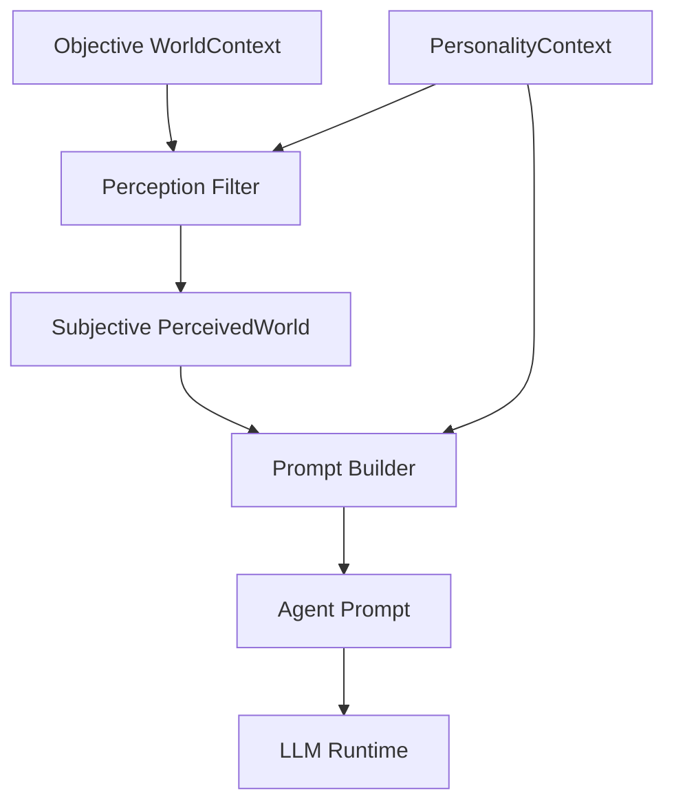

The fundamental transformation is:

```text
WorldContext + PersonalityContext
                |
                v
        Perception Filter
                |
                v
          PerceivedWorld
```

---

# 2. Architectural Position

The Perception Filter sits between the World Context layer and Prompt Construction.

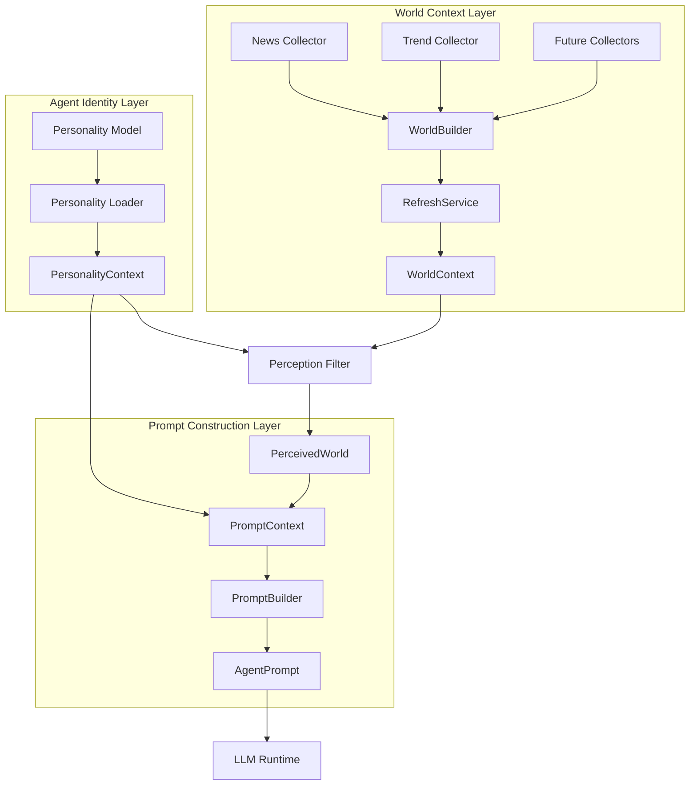

The Perception Filter therefore has a deliberately narrow architectural role.

It should not become:

- an interpretation engine
- a decision engine
- a personality simulator
- a memory system
- a planning system
- an action selector

Its job is attention selection.

---

# 3. The Original Sprint 20 Embedding Approach

The first implementation attempted to determine semantic relevance using embeddings.

The architecture was roughly:

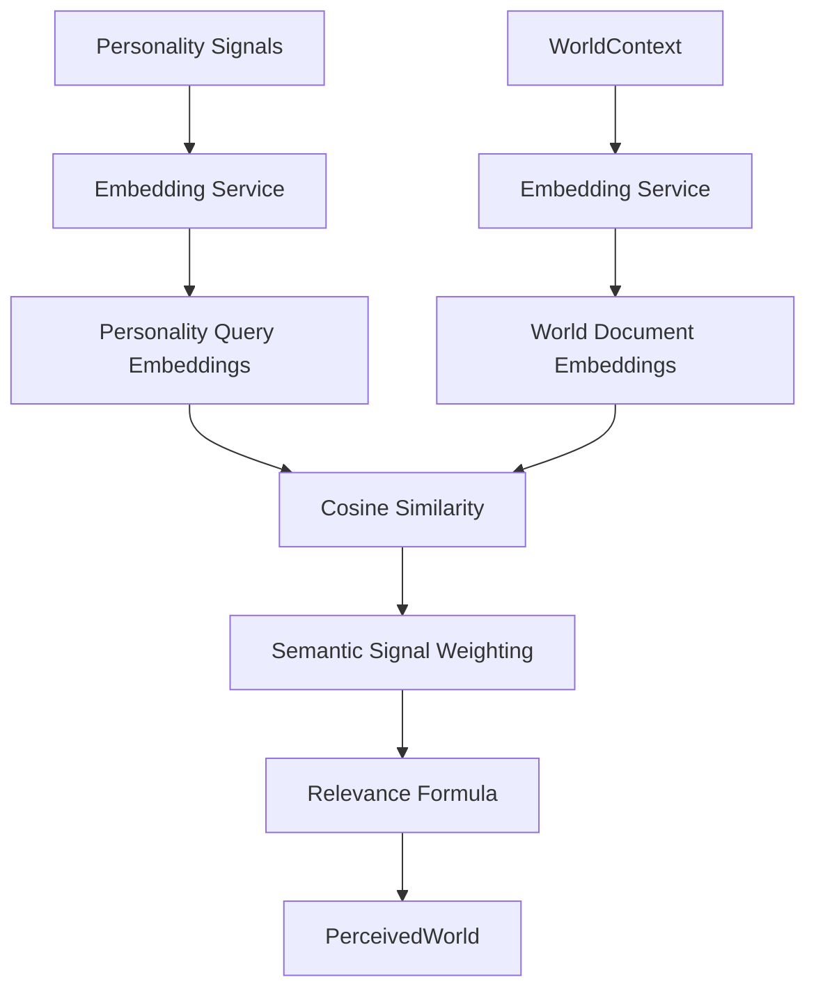

The design attempted to combine:

1. deterministic textual matching
2. semantic embedding similarity

The intended final relevance model was conceptually:

```text
Final Relevance
    =
Deterministic Relevance
+
Semantic Relevance
```

with configurable weights.

The implementation also attempted to distinguish:

- personality signals as retrieval queries
- world items as retrieval documents

using Google's Gemini embedding API.

---

# 4. Original Embedding Architecture

The original implementation introduced:

- `EmbeddingService`
- `SimilarityService`
- `GoogleEmbeddingService`
- query/document embedding task types
- cosine similarity
- semantic signal weighting
- minimum semantic similarity thresholds
- minimum final relevance thresholds

The Google embedding implementation used:

```text
Model:
gemini-embedding-001

Output dimensionality:
768

Personality signals:
RETRIEVAL_QUERY

World content:
RETRIEVAL_DOCUMENT
```

The intended semantic pipeline was:

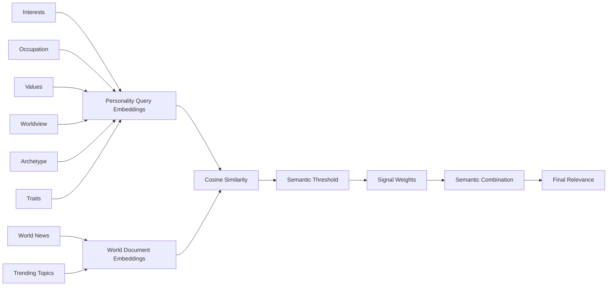

This looked architecturally reasonable.

However, the actual runtime behavior exposed a serious problem.

---

# 5. What Failed

The embedding-based system did not produce sufficiently useful or trustworthy semantic relevance scores for the Perception Filter.

The issue was not that embeddings failed to generate vectors.

The embedding API worked.

Requests succeeded.

The system reported:

```text
Embedding provider: Google Gemini
Embedding model: gemini-embedding-001
Embedding dimensions: 768
```

The problem was the **meaning of the resulting similarity scores in the specific perception task**.

The system needed to answer:

> “Does this world item deserve attention from this particular personality?”

Cosine similarity answered a weaker question:

> “How geometrically similar are these two embedding vectors?”

Those are not necessarily equivalent.

---

# 6. Observed Failure

The perception pipeline repeatedly produced:

```text
PERCEPTION STATE
EMPTY

No relevant world information was perceived.
```

The diagnostics repeatedly showed:

```text
Final relevance: 0.0000

Deterministic score: 0.00.
Semantic score: 0.00.
No strong semantic personality matches.
```

This happened across multiple agents and multiple different world snapshots.

For example, the world changed from:

- a grizzly bear escaping a zoo
- international political news
- football news
- political appointments
- celebrity news

to another set including:

- water supply problems
- an extravagant wedding
- reckless driving videos
- a musician leaving a band

Yet the agents continued to perceive nothing.

---

# 7. Why This Was a Problem

The Perception Filter was intended to produce differentiated attention.

Instead, the practical result was effectively:

```text
WorldContext
     |
     v
Perception Filter
     |
     v
EMPTY
```

for every tested personality.

That is a major failure because the system's core promise is that different citizens should notice different things.

A perception system that consistently notices nothing cannot perform that role.

---

# 8. Important Lesson

The failure was not simply:

> “The threshold is too high.”

Lowering the threshold could potentially make more items pass, but that would not establish that the scores themselves are semantically calibrated for the intended task.

Likewise, simply increasing or decreasing:

```text
minimum_relevance
minimum_semantic_similarity
```

would amount to tuning around an uncertain signal.

The deeper problem was:

> **Raw embedding similarity was being treated as a sufficiently calibrated measure of personality-to-world relevance.**

For this system, that assumption was not demonstrated by the tests.

---

# 9. Why We Are Scrapping the Embedding Approach

The project therefore decided not to continue endlessly tuning:

- cosine similarity
- embedding thresholds
- signal weights
- dimensionality
- query/document formatting
- arbitrary score normalization

The Perception Filter needs a semantic judgment, not merely a vector distance.

The new design asks an external LLM to explicitly judge the relationship between:

```text
PersonalityContext
        +
World Item
        =
Relevance Judgment
```

The LLM can evaluate semantic relationships such as:

- direct interest
- occupational relevance
- value relevance
- worldview relevance
- archetype relevance
- contextual relevance
- indirect but meaningful relevance

without requiring the system to infer the meaning of a cosine score.

---

# 10. New Direction — LLM as Semantic Relevance Judge

The new architecture is:

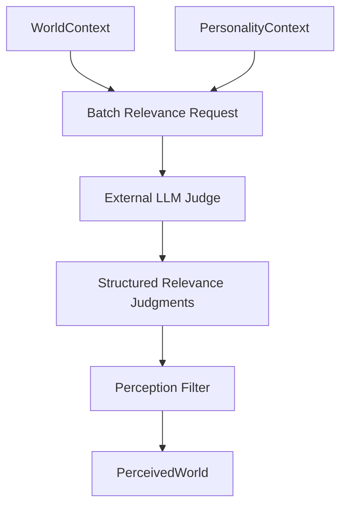

The external LLM is **not** the agent.

It is not asked to:

- roleplay the citizen
- make decisions
- write the agent's thoughts
- determine actions
- interpret the entire world
- generate a response

It performs one narrow task:

> **Judge whether each world item is relevant enough to deserve this personality's attention.**

---

# 11. Batch Processing

The new system should use a short batched external API request rather than making an individual LLM request for every world item.

Conceptually:

```text
Personality
     +
World Item 1
World Item 2
World Item 3
World Item 4
World Item 5
     |
     v
ONE LLM REQUEST
     |
     v
Structured judgments
```

Instead of:

```text
Personality + Item 1 -> LLM
Personality + Item 2 -> LLM
Personality + Item 3 -> LLM
Personality + Item 4 -> LLM
Personality + Item 5 -> LLM
```

Batching is important because the perception layer should remain:

- inexpensive
- bounded
- predictable
- easy to debug
- easy to replace

---

# 12. Proposed Relevance Judgment

The judge should return structured data rather than free-form prose.

A conceptual result could look like:

```json
{
  "item_id": "world-item-4",
  "relevant": true,
  "score": 0.82,
  "signals": [
    {
      "category": "occupation",
      "signal": "urban dog walking",
      "strength": 0.91
    },
    {
      "category": "interest",
      "signal": "investigating hidden treat stashes",
      "strength": 0.67
    }
  ]
}
```

For an irrelevant item:

```json
{
  "item_id": "world-item-7",
  "relevant": false,
  "score": 0.12,
  "signals": []
}
```

The exact schema remains a Sprint 20 implementation decision.

The important architectural requirement is that the output is:

- structured
- deterministic enough for downstream processing
- machine-readable
- bounded
- explainable

---

# 13. The Judge Must Not Think for the Agent

This distinction is critical.

The LLM judge should not answer:

> “What should Sam do about this?”

It should answer:

> “How relevant is this item to Sam's personality and attention?”

For example:

```text
World item:
"Grizzly bear escapes Calgary Zoo."

Personality:
Noir private eye
Pet sitter
Urban dog walker
Interested in hidden treat stashes
Interested in suspicious animals
Values protecting the pack
```

The judge might conclude:

```text
Relevant: true
Score: 0.74
Reason:
Animal escape is strongly related to the agent's
animal-oriented occupation and investigative identity.
```

The filter then passes the item onward.

It does not decide what Sam thinks or does.

---

# 14. Revised Runtime Architecture

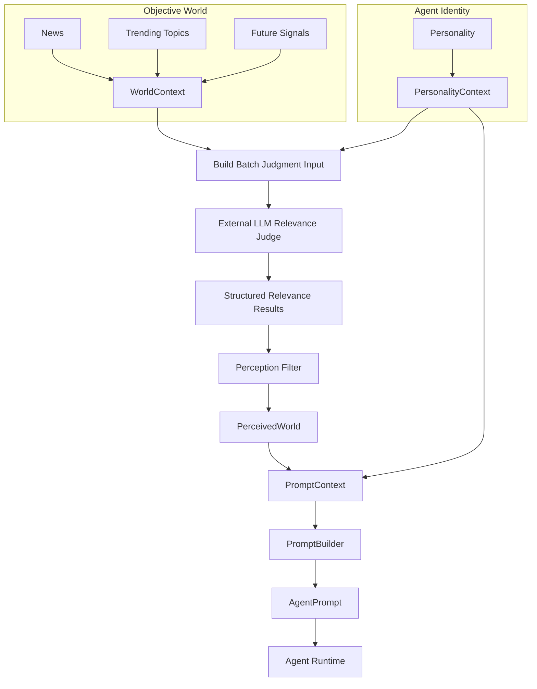

---

# 15. New Perception Filter Contract

The Perception Filter should eventually expose a simple conceptual contract:

```text
filter(
    world_context,
    personality_context
)
    ->
perceived_world
```

The internal implementation may involve:

1. batch preparation
2. external semantic judgment
3. result validation
4. relevance thresholding
5. sorting
6. conversion into `PerceivedWorld`

But downstream systems should not need to know how semantic relevance was calculated.

---

# 16. Sprint 20 Perception Filter Phases

## Phase 20C-1 — Architecture Reset

### Goal

Formally retire the embedding-based perception implementation.

### Tasks

- Remove perception-specific dependence on embedding similarity.
- Preserve reusable embedding infrastructure if other systems need it.
- Remove semantic threshold tuning from the perception design.
- Define the new LLM-judge contract.
- Define the boundary between perception and interpretation.

### Exit Criteria

The project has a documented replacement architecture and no ambiguity about the Perception Filter's responsibility.

---

# Phase 20C-2 — Relevance Judgment Contract

### Goal

Define exactly what the external LLM is allowed to judge.

### Tasks

Define:

- input personality representation
- input world-item representation
- relevance score
- relevance boolean
- signal/category attribution
- optional short diagnostic reason
- output schema
- validation rules

### Core question

The judge must answer:

> “Does this world item deserve this agent's attention?”

Not:

> “What does the agent think about it?”

### Exit Criteria

A versioned structured schema exists for the external judgment response.

---

# Phase 20C-3 — Batch LLM Judge

### Goal

Implement a single external LLM call capable of judging multiple world items.

### Tasks

- Build batch request payload.
- Include personality context once.
- Include multiple world items.
- Assign stable item identifiers.
- Request structured output.
- Parse response.
- Validate every returned item.
- Handle missing or malformed judgments.

### Target flow

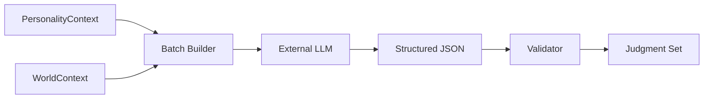

### Exit Criteria

One perception evaluation cycle can judge an entire bounded batch of world items successfully.

---

# Phase 20C-4 — Relevance Calibration

### Goal

Calibrate the new judge against intentionally constructed examples.

This phase replaces the previous attempt to calibrate raw embedding similarity.

### Build a test matrix

Examples should include:

| Case | Expected |
|---|---|
| Strong direct interest | Very relevant |
| Strong occupation match | Relevant |
| Strong value match | Relevant |
| Strong worldview match | Relevant |
| Strong archetype match | Relevant |
| Weak thematic overlap | Usually irrelevant |
| Generic world news | Usually irrelevant |
| Completely unrelated item | Irrelevant |
| Indirect but meaningful connection | Moderately relevant |
| Multiple weak signals | Potentially relevant |
| One extremely strong signal | Relevant |

### Important

Calibration should test **behavior**, not just numerical distributions.

The question is:

> Does the filter notice the things that this personality should notice?

### Exit Criteria

A fixed regression suite demonstrates useful and differentiated perception across multiple personalities.

---

# Phase 20C-5 — PerceivedWorld Integration

### Goal

Connect the new judge to the existing perception output.

### Tasks

- Convert accepted judgments into `PerceptionItem`.
- Preserve world content.
- Attach relevance.
- Attach diagnostics/reason.
- Sort by relevance.
- Populate the correct `PerceivedWorld` categories.
- Preserve empty categories where no relevant information exists.

### Exit Criteria

The Prompt Builder receives a valid `PerceivedWorld` without needing to know anything about the external judge.

---

# Phase 20C-6 — Multi-Agent Differentiation

### Goal

Prove that identical objective reality produces different subjective attention.

Example:

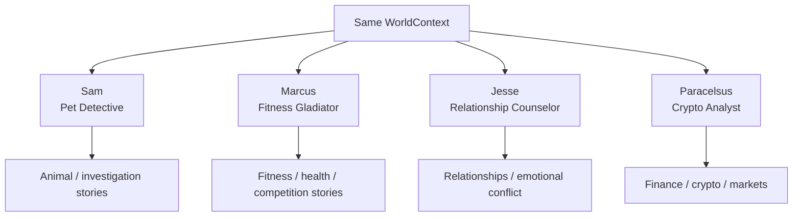

The actual results should emerge from the relevance judge rather than hard-coded category routing.

### Exit Criteria

The same world snapshot produces meaningfully different perceived worlds for different personalities.

---

# Phase 20C-7 — Failure Handling and Operational Hardening

### Goal

Make the external dependency safe for production.

### Tasks

Handle:

- API timeout
- rate limits
- malformed JSON
- missing item judgments
- duplicate item judgments
- invalid scores
- partial batch failures
- external API unavailable
- unexpected model output

### Fallback policy

The project must explicitly decide what happens when the judge is unavailable.

Possible policies include:

```text
FAIL CLOSED
    -> PerceivedWorld is empty.

FAIL OPEN
    -> Allow a conservative deterministic subset.

LAST KNOWN
    -> Reuse cached perception results where appropriate.
```

The correct policy should be chosen based on the runtime requirements of SketchX.

### Exit Criteria

Perception failure cannot silently corrupt the rest of the agent pipeline.

---

# 17. Long-Term Evolution

The initial replacement only introduces:

```text
WorldContext
+
PersonalityContext
```

Later, the perception function may incorporate additional cognitive context:

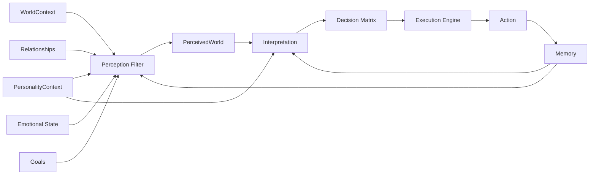

This future architecture preserves the distinction between:

### Perception

> What deserves attention?

### Interpretation

> What does it mean?

### Decision

> What should I do?

### Execution

> Perform the action.

These should remain separate systems.

---

# 18. Architectural Principle

The most important lesson from the first implementation is:

> **Do not confuse semantic similarity with semantic judgment.**

Embeddings remain useful technology.

They may still be appropriate for:

- retrieval
- memory search
- recommendations
- clustering
- similarity search
- deduplication

But Sprint 20's Perception Filter requires a higher-level semantic judgment:

```text
Does this matter to this particular personality?
```

For the current SketchX architecture, an external LLM judge is therefore being adopted as the semantic relevance mechanism.

---

# 19. Final Sprint 20C Direction

The old pipeline:

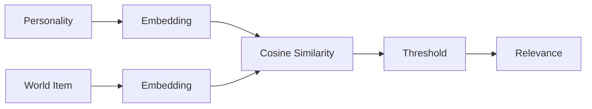

is being retired.

The new pipeline is:

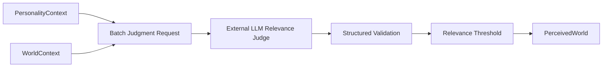

The desired outcome is simple:

> **The Perception Filter should reliably identify which parts of objective reality deserve the attention of each individual citizen.**

It should do this without making decisions for the citizen and without requiring downstream systems to understand the semantic machinery used to make the relevance judgment.

---

# 20. Phase Summary

| Phase | Purpose | Status |
|---|---|---|
| 20C-1 | Architecture Reset | Planned |
| 20C-2 | Relevance Judgment Contract | Planned |
| 20C-3 | Batch LLM Judge | Planned |
| 20C-4 | Relevance Calibration | Planned |
| 20C-5 | PerceivedWorld Integration | Planned |
| 20C-6 | Multi-Agent Differentiation | Planned |
| 20C-7 | Failure Handling / Hardening | Planned |

---

# 21. Definition of Done

Sprint 20C Perception Filter is complete when:

- [ ] The embedding-based perception scoring system has been retired.
- [ ] The external LLM relevance-judge contract is defined.
- [ ] World items can be evaluated in a bounded batch.
- [ ] The judge returns validated structured relevance results.
- [ ] Relevance scores have been behaviorally calibrated.
- [ ] Strong personality/world relationships reliably pass.
- [ ] Weak and unrelated relationships reliably fail.
- [ ] Different personalities perceive different subsets of the same world.
- [ ] `PerceivedWorld` remains independent from the implementation of semantic judgment.
- [ ] The filter does not perform interpretation or decision-making.
- [ ] External API failures have an explicit fallback policy.
- [ ] Regression tests cover the major relevance cases.
- [ ] Prompt construction receives the resulting `PerceivedWorld` correctly.

---

# 22. Closing Decision

The Perception Filter journey in Sprint 20 demonstrated an important architectural distinction.

The original embedding approach was technically functional but did not provide sufficiently trustworthy semantic relevance behavior for the actual cognitive task.

Rather than continuing to tune uncertain similarity thresholds indefinitely, Sprint 20C is resetting the implementation around a more explicit semantic judgment model.

The new principle is:

> **Use the external LLM to judge relevance. Use the Perception Filter to enforce the attention boundary. Keep interpretation and decision-making elsewhere.**

This keeps the Perception Filter narrow, testable, replaceable, and aligned with the larger SketchX cognitive architecture.
